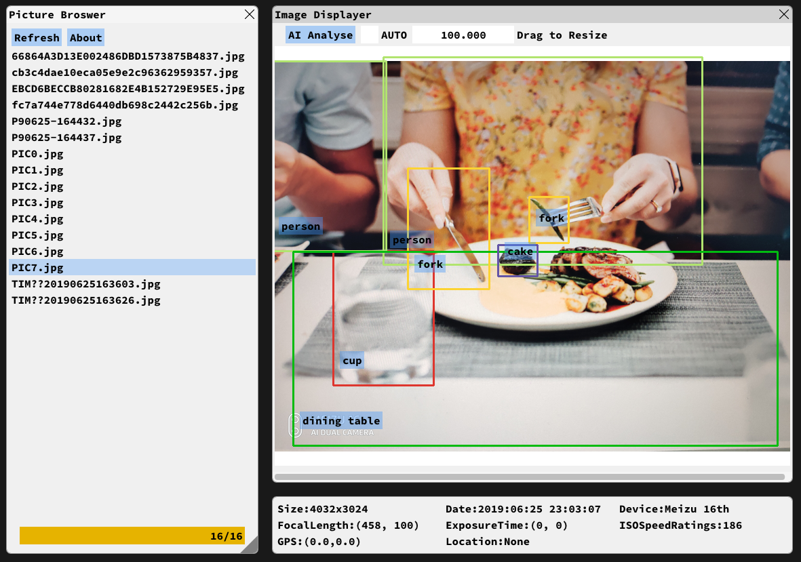
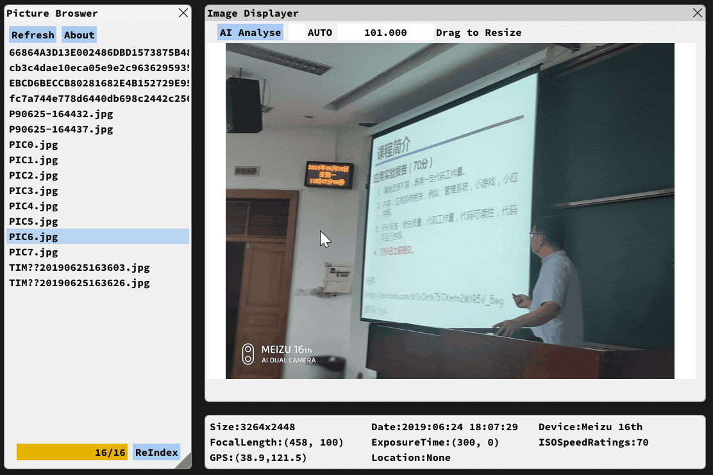
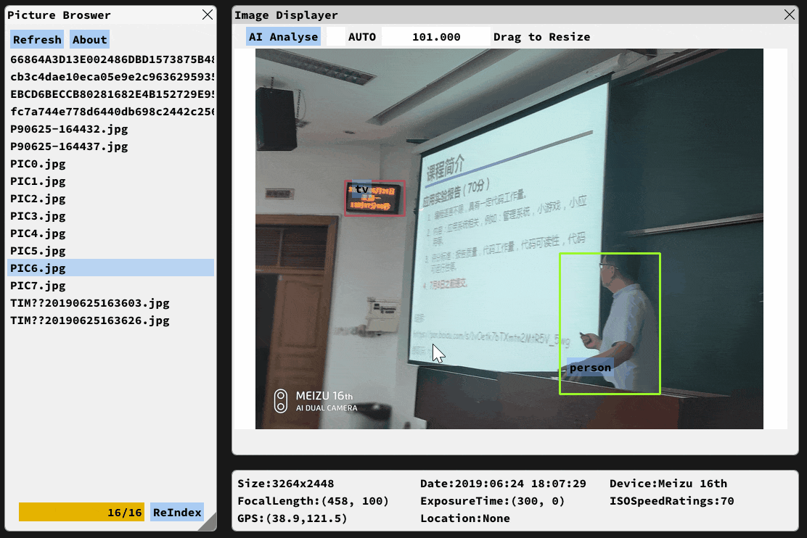
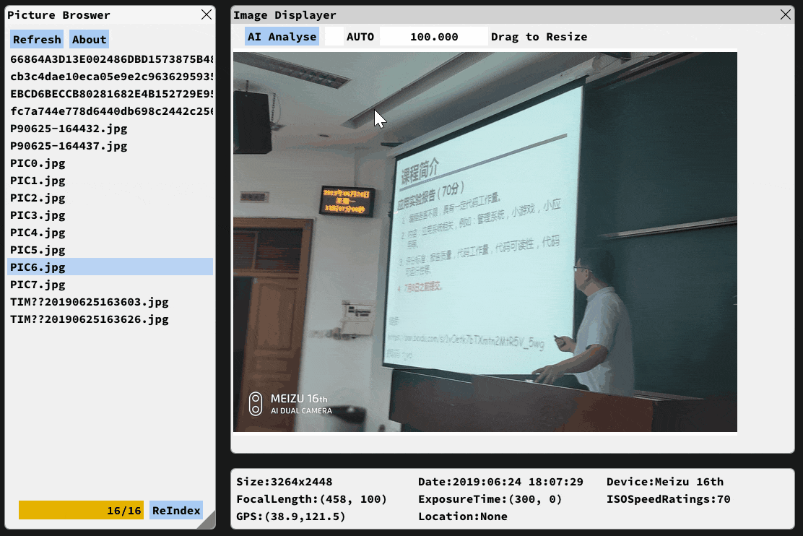

<p align="center">
<!--
  <a href="http://lcui.org/">
    
  </a>-->
  <h3 align="center">Smart Photo Manager</h3>
  <p align="center">
    A Personal Photo Management System for Everyone
  </p>
  <p align="center">
    
    <a href="http://opensource.org/licenses/MIT"></a>
    
    
  </p>
</p>

## Table of contents

- [Introduction](#introduction)
- [Usage](#usage)
- [Technology Stack](#Technology-Stack)
- [About](#about)

## Introduction

The Smart Photo Manager (**SPM**) embraces the recent advances of deep learning (DL), and provides a unified software experience for managing personal photos. 

### Features:

* **Photo In AI**: Organize your personal photos in as much as **80** classes
* **One-Key-Search**: If you want to locate similar photos, click "AI analyse" and choose the object you want to retrieve.
* **User-Friendly**: Clear and adjustable layout, Fresh UI
* **MetaInfo**: Describe the photo with details like size, data, focal time and etc.
* **MultiLanguage**: Provide "i18n.py" for localiztion.

### Screenshots
**Main Window**
#### 

**Photo In AI**: Auto detect the objects in yout photos 
#### 

**AI Search**: Search the photos with same objects
#### 

**Auto Layout**: Calculate the real-time postions for every subwindow 
#### 

**Resize Photo**: Drag to resize the photo from 10% to 1000%
#### 

## Usage


### Prerequisites
	pip install requirements.txt

### RUN SPM
	python main.py

## Technology Stack

#### User Interface:

- **IMGUI**: Bloat-free Immediate Mode Graphical User interface for C++ with minimal dependencies
- **Bimpy**: imgui for python

#### Image process:

- **Opencv2**: An Open Computer Vision Library

- **CVLIB**: A high level easy-to-use open source Computer Vision library for Python.

- **PIL**: A Python Imaging Library

#### Technical Features:

- **Adjustable Windows**: Fit for any screen resolution or any window size

- **i18n**: Only support English now!

- **Highly Modular and Extensible**: Every Function can be easily edited

## About

This software (SPM) is an coursework for "Programming Designment Training" and the instructor is Heng, Qi

```
Author: Chengxuan, Ying
Last Update: 6.25.2019
```
